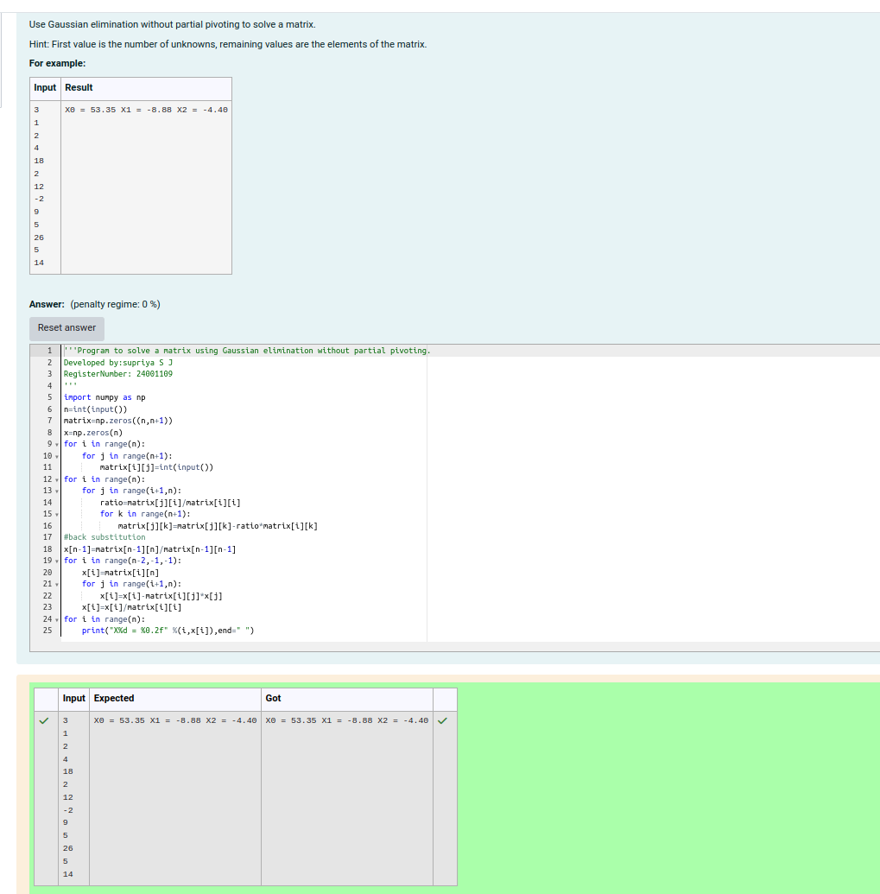

# Gaussian Elimination

## AIM:
To write a program to find the solution of a matrix using Gaussian Elimination.

## Equipments Required:
1. Hardware – PCs
2. Anaconda – Python 3.7 Installation / Moodle-Code Runner

## Algorithm
 
1. Input the Number of Unknowns: Read the integer 𝑛( representing the number of unknowns.)

2. Initialize the Augmented Matrix: Create an 𝑛×(𝑛+1) matrix ,n×(n+1) matrix a initialized to zeros to store coefficients and constants. Create an array x of size 𝑛

3. Fill the Augmented Matrix:

4. Check for Zero on the Diagonal: Before proceeding with elimination, check if the diagonal element 𝑎[𝑖][𝑖]=0 a[i][i]=0. If true, terminate with an error message ("Divide by zero detected").

5. Forward Elimination (Pivot Row Processing):

6. Compute Row Elimination:

7. Check for Singular Matrix:

8. Back Substitution (Start from the Last Variable):

9. Iterative Back Substitution

10. Output the Solutions
 
 

## Program:
```
/*
'''Program to solve a matrix using Gaussian elimination without partial pivoting.
Developed by:supriya S J 
RegisterNumber: 24001109
'''
import numpy as np
n=int(input())
matrix=np.zeros((n,n+1))
x=np.zeros(n)
for i in range(n):
    for j in range(n+1):
        matrix[i][j]=int(input())
for i in range(n):
    for j in range(i+1,n):
        ratio=matrix[j][i]/matrix[i][i]
        for k in range(n+1):
            matrix[j][k]=matrix[j][k]-ratio*matrix[i][k]
#back substitution
x[n-1]=matrix[n-1][n]/matrix[n-1][n-1]
for i in range(n-2,-1,-1):
    x[i]=matrix[i][n]
    for j in range(i+1,n):
        x[i]=x[i]-matrix[i][j]*x[j]
    x[i]=x[i]/matrix[i][i]
for i in range(n):
    print("X%d = %0.2f" %(i,x[i]),end=" ") 
*/
```

## Output:



## Result:
Thus the program to find the solution of a matrix using Gaussian Elimination is written and verified using python programming.

